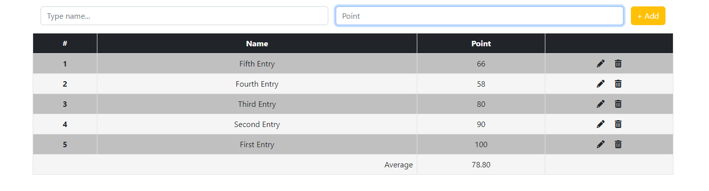
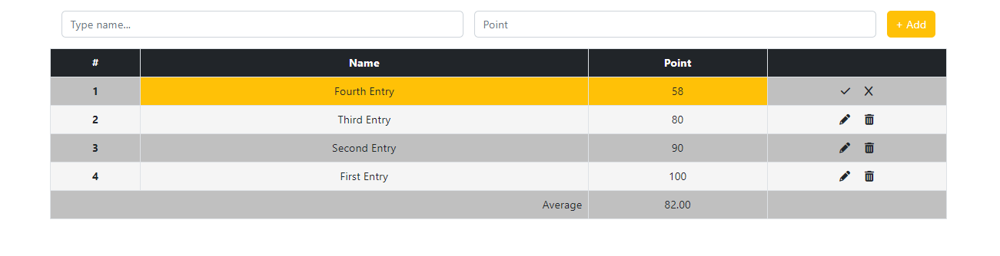

# Table Created With Vanilla JavaScript

## Frameworks and third parties

1 - [Bootstrap](https://getbootstrap.com)

2 - [FontAwesome](fontawesome.com)

## Features

• Table rows are updated without the use of arrays

• Both inputs are checked whether they are empty or only consists of whitespace

• First input cannot take "only number" entries

• Second input can only take "number" entries

• Each wrong entry gives an error message below the input fields

• Input fields are cleared after submit

• Latest input is added to the first row of the table

• Rows can be modified with "pencil" icon, deleted with "trashcan" icon

• Before deletion, confirmation is required by the client

• Modified rows can be confirmed with "check" icon

• Modified rows are also controlled whether they meet the input criteria, if not, no action is taken

• Modifications can be canceled with "X" icon

• An "average" row is created after the first entry

• Average row takes points from the rows and gives an average according to the number of entries

• After every modification inside the rows, average is updated

• Table rows are sorted ascending by the number of entries in the table (1 is top row)

• With every new entry, and row deletion, index numbers are updated accordingly

## Project Overview

